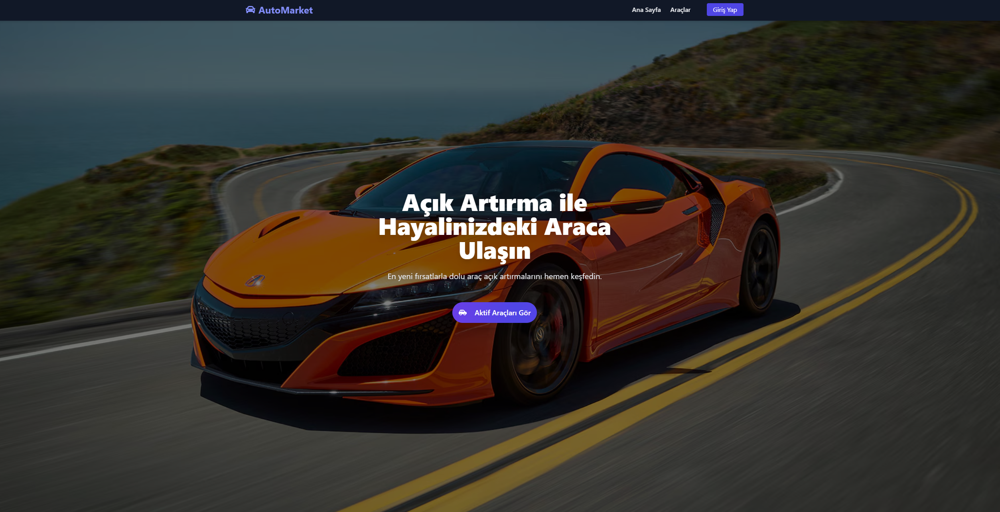
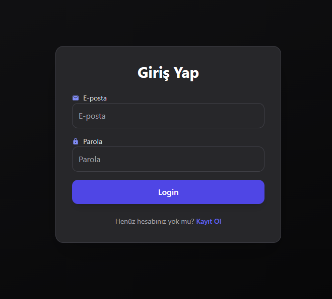
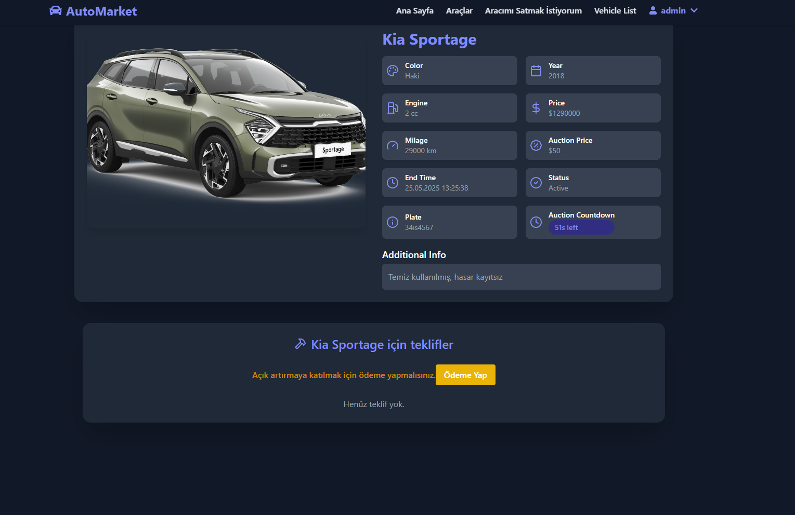
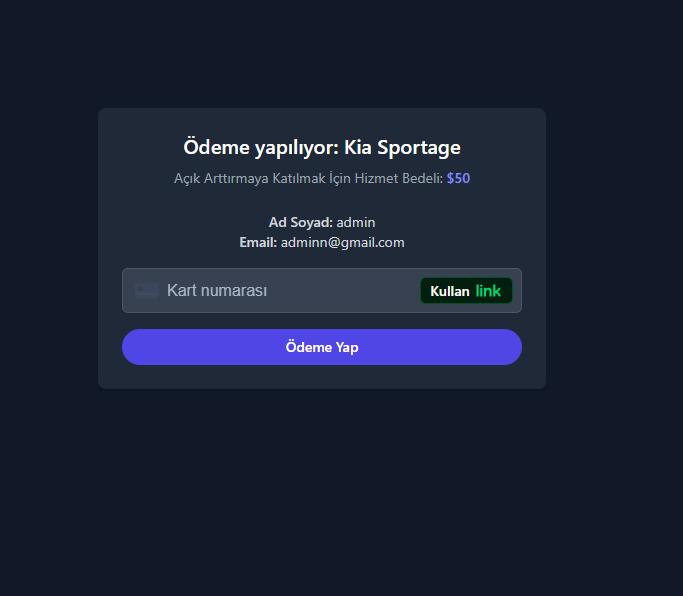
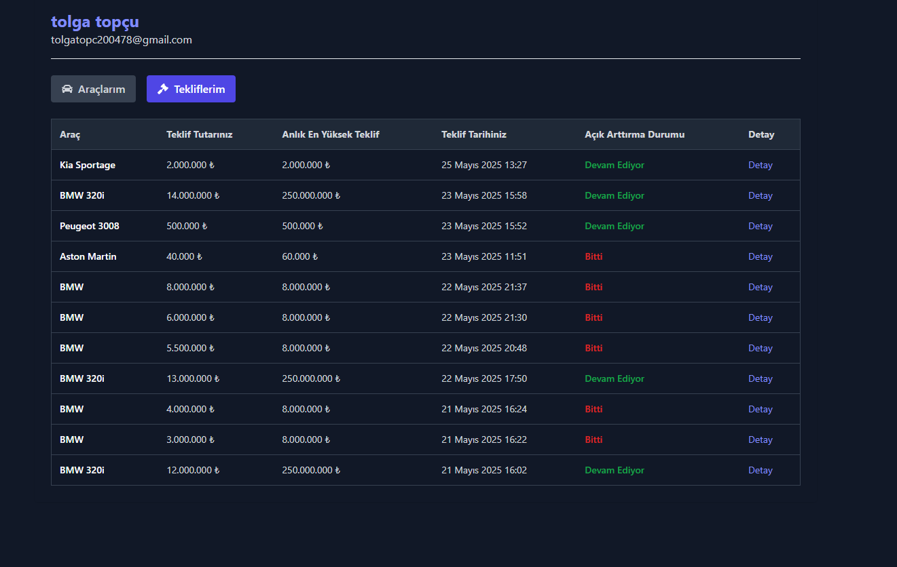
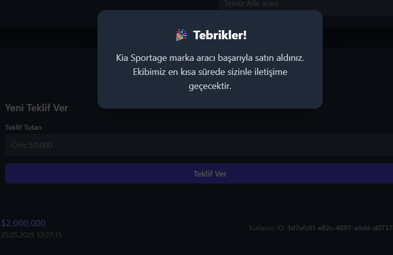
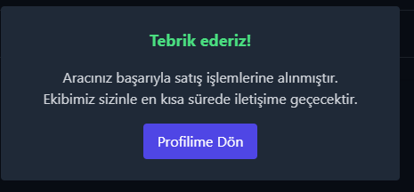

# 🚗 Car Auction Platform

Modern, güvenli ve kullanıcı dostu bir **araç açık artırma platformu**. Kullanıcılar araç listeleyebilir, teklif verebilir, ödemelerini Stripe ile gerçekleştirebilir ve satış yapabilir. Tamamen responsive, sade ve güçlü bir kullanıcı deneyimi sunar.



---

## 📱 Özellikler

### 👤 Kullanıcı Paneli
- Kayıt olma ve giriş yapma (JWT tabanlı kimlik doğrulama)
- Kullanıcı profili üzerinden:
  - **Koyduğu araçları** görme
  - **Verdiği teklifleri** takip etme
  - Kazandığı teklifler için **ödeme yapma**
- Stripe entegrasyonu ile güvenli ödeme

### 🚙 Araç Satışı
- Araç listeleme (resim, başlık, açıklama, başlangıç fiyatı, açık artırma süresi vb.)
- Araçlara gelen teklifleri görüntüleme
- Araç satış geçmişi

### 🧠 Sistem Özellikleri
- Tamamen **responsive** frontend tasarımı (mobil, tablet, desktop uyumlu)
- Stripe ile **güvenli ödeme entegrasyonu**
- RESTful API ile modern mimari
- Kullanıcı bazlı veri filtreleme ve erişim kontrolü

---

## 🖼️ Ekran Görüntüleri

### 🔐 Giriş Sayfası


### 🚘 Araç Detay Sayfası


### 💸 Ödeme Sayfası


### 👤 Kullanıcı Profili


### 🏆 Kazanılan Araçlar


### 💼 Satış Onayı


---

## 🚀 Kullanıcı Akışı

Platformdaki temel kullanıcı etkileşimi:

1. **Kayıt ve Giriş:** Kullanıcı kaydolur ve güvenli bir şekilde giriş yapar.
2. **Araç Keşfi:** Araç listeleyebilir veya mevcut araçlara göz atabilir.
3. **Teklif Verme:** İlgilendiği araca teklif verir.
4. **Kazanan Belirlenmesi:** Açık artırmayı kazanırsa ödeme ekranına yönlendirilir.
5. **Stripe ile Ödeme:** Güvenli ödeme yapılır ve araç artık ona aittir.
6. **Profil Takibi:** Kullanıcı, geçmiş araçları ve teklifleri görüntüleyebilir.

---

## 🤝 Katkı Sağlamak İster Misin?

Bu projeye katkı sağlamak istersen:

1. Bu repository’yi **forkla**  
2. Yeni bir branch oluştur: `feature/senin-özelliğin`  
3. Geliştirmeleri yap  
4. Bir **Pull Request** gönder  

Her katkıyı memnuniyetle karşılıyoruz! 🙌

---

## ✉️ İletişim

**Tolga Topçu**  
💼 [LinkedIn Profilim](https://www.linkedin.com/in/tolgatopcu1)  
🐙 [GitHub Profilim](https://github.com/tolgatopcu1)

---

## ⚙️ Kurulum

### 🔽 1. Reposu Klonla

```bash
git clone https://github.com/tolgatopcu1/CarAuctionPlatform.git
cd CarAuctionPlatform

cd AuctionProject
dotnet restore            # Gerekli NuGet paketlerini yükler
dotnet ef database update # Veritabanı migrasyonlarını uygular
dotnet run                # Backend servisini başlatır

cd AuctionProjectClient/MyAuctionClientApp
npm install   # Gerekli Node.js paketlerini yükler
npm run dev   # Geliştirme sunucusunu başlatır